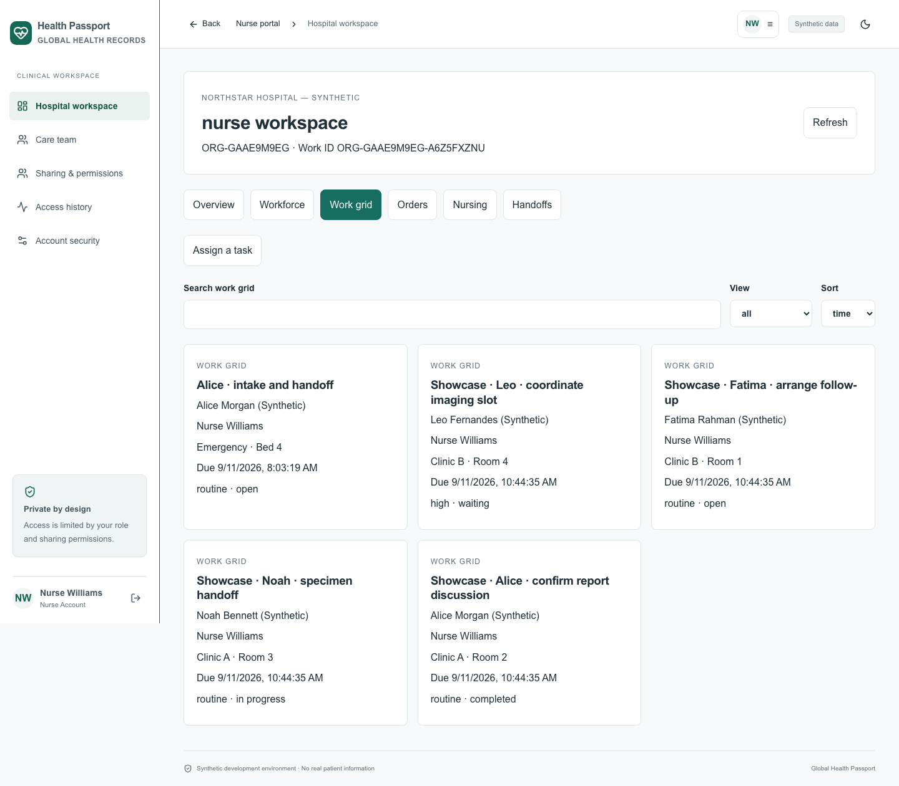

# Health Passport - Fictional demonstration report

Prepared 11 September 2026. All people, stories, values, addresses, insurance plans and messages below are invented. This is a local demonstration, not clinical advice or real coverage.

## Open the demonstration

- Web: http://localhost:5173/?portal=doctor
- Mobile-code browser preview: http://localhost:5174/
- Doctor username: `hospitaldoctor`. Use the existing demo password in `LOCAL_ACCESS.txt`. Other accounts are listed below; do not distribute the password in a public presentation.
- Desktop > Health Passport links to this complete local project.
- Schedule snapshot: 2026-09-11 (America/New_York). Later, select this date in the agenda.

## Everything added

| Item | Count |
|---|---:|
| Fictional patient stories | 4 (3 new accounts + existing Alice) |
| Authored clinical entries | 26 |
| Structured order records | 5 |
| Completed result reports | 2 |
| Total new clinical entries | 33 |
| Requests / orders | 5 |
| Curated nurse tasks | 4 |
| Additional order-linked tasks | 5 |
| Appointments | 4 |
| Saved unfinished SOAP draft | 1 |
| Care conversations / messages | 3 / 6 |
| Structured handoffs | 2 |
| Insurance profiles with billing shares | 2 |
| Approved fictional comparison plans | 3 |

Each patient has history, allergy reconciliation, assessment context, nurse vitals, a follow-up plan and consultation overview. Fatima has the additional fictional prescription and dispensing record. Existing earlier demonstration data remains unchanged.

## Patient stories

### Alice Morgan (Synthetic)

- Login: `hospitalalice`; Health ID: `KW6V6HRCU`; age: 34; occupation: Museum programme coordinator.
- Appointment: 2026-09-11 at 8:00 AM Eastern, 30 minutes, in person.
- Location: Clinic A · Room 2.
- Presenting concern: Review of a recent cough and fatigue episode.

Chief complaint: dry cough and tiredness for three days during a busy exhibition week. Onset gradual; symptoms more noticeable late in the day. No previous similar episode recorded in this fictional story. Past history: seasonal nasal symptoms. Family history: parent with high blood pressure. Personal history: walks to work, does not smoke, lives with a partner. Occupation: museum programme coordinator. Fictional address: 14 Example Lane, Demo District. No real contact information.

Allergy / intolerance: Patient reports a rash after penicillin as a teenager; timing and original documentation are not available. Demonstrates a patient-reported allergy requiring reconciliation, not verified testing.

Assessment context: Fictional working assessment: recent respiratory symptoms under review. No real diagnosis is established by this demonstration.

Invented vitals: {"temperature_c": 36.8, "spo2_percent": 98, "pulse_bpm": 76, "systolic_mmhg": 118, "diastolic_mmhg": 76}.

Follow-up: Review the attached fictional reports, reconcile the reported allergy, document the discussion and confirm the next follow-up with Alice. No real treatment instruction.

### Noah Bennett (Synthetic)

- Login: `showcasenoah`; Health ID: `CAGNH5SDP`; age: 52; occupation: Bus route dispatcher.
- Appointment: 2026-09-11 at 8:30 AM Eastern, 30 minutes, in person.
- Location: Clinic A · Room 3.
- Presenting concern: Routine health review with blood work pending.

Chief complaint: routine annual review and a request to discuss occasional tiredness after rotating shifts. Symptoms occur near the end of a long workday. Past history: no surgeries reported in this fictional record. Family history: sibling with raised cholesterol. Personal history: irregular sleep during shift changes; enjoys weekend gardening. Occupation: bus route dispatcher. Fictional address: 22 Sample Crescent, Demo District.

Allergy / intolerance: No medication allergies reported at this fictional intake. This is a reported history, not an assertion that every exposure is safe.

Assessment context: Preventive review encounter; laboratory request remains pending. The demonstration does not infer a diagnosis from the request.

Invented vitals: {"temperature_c": 36.6, "spo2_percent": 99, "pulse_bpm": 70, "systolic_mmhg": 126, "diastolic_mmhg": 80}.

Follow-up: Keep the laboratory task visible until the result arrives. Show how the clinician can prepare a draft and return later without copying the patient history.

### Fatima Rahman (Synthetic)

- Login: `showcasefatima`; Health ID: `TWH6XXC2Q`; age: 28; occupation: Product illustrator.
- Appointment: 2026-09-11 at 9:00 AM Eastern, 30 minutes, in person.
- Location: Clinic B · Room 1.
- Presenting concern: Follow-up for recurring seasonal nasal symptoms.

Chief complaint: sneezing and itchy eyes recurring during spring cleaning. Onset intermittent over two weeks; patient notices symptoms around dusty storage boxes. Past history: similar seasonal symptoms in prior years. Family history: sibling reports hay-fever symptoms. Personal history: works from a home studio, no tobacco use reported. Occupation: product illustrator. Fictional address: 8 Illustration Walk, Demo District.

Allergy / intolerance: No drug allergies reported; patient describes sensitivity to dust. Keep environmental symptoms distinct from a confirmed drug allergy.

Assessment context: Patient-reported seasonal nasal symptoms, awaiting review. The narrative demonstrates history and follow-up tracking.

Invented vitals: {"temperature_c": 36.5, "spo2_percent": 99, "pulse_bpm": 74, "systolic_mmhg": 112, "diastolic_mmhg": 72}.

Follow-up: Use the follow-up task and message thread to confirm the symptom history and reconcile the demonstration medication list. No real prescribing advice.

### Leo Fernandes (Synthetic)

- Login: `showcaseleo`; Health ID: `ZLNACMBWM`; age: 41; occupation: Primary-school teacher.
- Appointment: 2026-09-11 at 9:30 AM Eastern, 30 minutes, in person.
- Location: Clinic B · Room 4.
- Presenting concern: Ankle discomfort after a weekend walk; imaging pending.

Chief complaint: left ankle discomfort after stepping off a low kerb during a weekend walk. Patient reports swelling later that evening and discomfort on stairs. Past history: a similar minor injury several years ago; no operation reported. Family history: no relevant condition reported in the fictional interview. Personal history: active at school, enjoys hiking. Occupation: primary-school teacher. Fictional address: 31 Storybook Road, Demo District.

Allergy / intolerance: Patient reports nausea with an unnamed pain medicine; original name and circumstances are unknown. Demonstrates an unreconciled intolerance rather than a confirmed allergy.

Assessment context: Fictional ankle symptom review. Imaging has been requested; no fracture or other diagnosis is inferred before the report.

Invented vitals: {"temperature_c": 36.7, "spo2_percent": 98, "pulse_bpm": 78, "systolic_mmhg": 122, "diastolic_mmhg": 78}.

Follow-up: Coordinate the imaging appointment, document the reported symptoms and leave the report-review task open until a report is available.

## Exact completed report text

### Showcase · Alice chest report result

FICTIONAL PRESENTATION REPORT — Study: DEMO-CHEST-ALICE-01. Technique: fictional two-view chest examination. Findings in the invented narrative: no focal air-space opacity, pleural fluid or pneumothorax described; cardiomediastinal silhouette not enlarged. Impression: no acute finding described in this fictional sample. Dr Ahmed attested the report, then Dr Smith reviewed. The UID is a demonstration reference; no actual DICOM pixels exist.

Author: Technician Patel (diagnostic). Observed: 2026-09-10T10:44:35.724901Z. Entered: 2026-09-11T10:44:40.478339Z. Related order record: `fdf26c37-c2c1-455a-8866-e06eaa0387ce`.

### Showcase · Alice CBC report result

FICTIONAL PRESENTATION REPORT — Accession: DEMO-CBC-ALICE-01. Specimen: EDTA whole blood. WBC 6.8 x10^9/L; haemoglobin 13.2 g/dL; platelets 254 x10^9/L. All values are invented; no laboratory range or clinical interpretation is asserted. Technician Lee recorded the sample result; Dr Smith reviewed it. Observation date precedes upload to demonstrate provenance.

Author: Technician Lee (lab). Observed: 2026-09-10T10:44:35.724901Z. Entered: 2026-09-11T10:44:40.454727Z. Related order record: `fea472c5-181c-4d0c-84da-911b71ceab74`.

## Requests and tasks

| Request | State | Result |
|---|---|---|
| Showcase · Alice CBC report | completed | Saved report |
| Showcase · Alice chest report | completed | Saved report |
| Showcase · Noah wellness panel | processing | None - pending |
| Showcase · Leo left ankle request | scheduled | None - pending |
| Showcase · Fatima follow-up review | ordered | None - pending |

| Nurse Williams task | State | Location |
|---|---|---|
| Showcase · Alice · confirm report discussion | completed / independently verified | Clinic A · Room 2 |
| Showcase · Noah · specimen handoff | in_progress | Clinic A · Room 3 |
| Showcase · Fatima · arrange follow-up | open | Clinic B · Room 1 |
| Showcase · Leo · coordinate imaging slot | waiting | Clinic B · Room 4 |

## Exact example messages

These operational messages remain separate from clinical record entries. An acknowledgment reply does not complete a task.

- **Dr Smith**: FICTIONAL DEMO — Both fictional reports are ready and reviewed. Please confirm that Alice can open them in her own timeline.
- **Nurse Williams**: FICTIONAL DEMO — acknowledged. I can see the assigned task and the dated patient history; I will update the task separately from this operational message.
- **Dr Smith**: FICTIONAL DEMO — The fictional specimen is in processing. Please leave the review task open until an actual demo result is entered.
- **Nurse Williams**: FICTIONAL DEMO — acknowledged. I can see the assigned task and the dated patient history; I will update the task separately from this operational message.
- **Dr Smith**: FICTIONAL DEMO — The fictional imaging request is scheduled. Please confirm the room and time before moving the workflow ahead.
- **Nurse Williams**: FICTIONAL DEMO — acknowledged. I can see the assigned task and the dated patient history; I will update the task separately from this operational message.

## Structured handoffs

### alice-handoff - acknowledged

Patient status: FICTIONAL SHOWCASE alice-handoff: patient history available in the authorized chart.

Pending tasks: Report discussion completed.

Medication attention: No real medication instruction. Any training prescription is explicitly fictional.

Tests awaiting results: Alice CBC and chest sample reports reviewed.

Observations: See the nurse-authored dated vital entry; do not copy it as a new measurement.

Escalation concerns: No real escalation. This field demonstrates structured handoff context.

### leo-handoff - sent

Patient status: FICTIONAL SHOWCASE leo-handoff: patient history available in the authorized chart.

Pending tasks: Imaging coordination remains waiting; check the task owner and timing.

Medication attention: No real medication instruction. Any training prescription is explicitly fictional.

Tests awaiting results: Left ankle imaging request scheduled; no result available.

Observations: See the nurse-authored dated vital entry; do not copy it as a new measurement.

Escalation concerns: No real escalation. This field demonstrates structured handoff context.

## Training prescription

Fatima: DEMO TRAINING TABLET is a nonexistent medicine. Quantity 10 fictional units, no refills; a linked pharmacy event records one demonstration unit. No real medicine is prescribed, dispensed or administered. This shows recipient assignment and quantity tracking.

## Insurance examples

| Plan | Monthly premium USD | Deductible USD | Out-of-pocket USD | Network |
|---|---:|---:|---:|---|
| Showcase / Harbor Starter | 220 | 1800 | 6500 | HMO |
| Showcase / Harbor Flexible | 365 | 900 | 4500 | PPO |
| Showcase / Harbor Family | 480 | 1500 | 7000 | EPO |

All three include invented comparison text, an illustrative $25 office copay and 20% coinsurance description. No actual benefits, provider network or enrollment exist. No sponsorship was activated.

- Noah: Example Unconnected Provider - Fictional -> UNKNOWN, synthetic=true.
- Fatima: Synthetic Harbor Health -> VERIFIED, synthetic=true.
- Neither contacted a real insurer. Profiles are patient-owned and specifically shared with the fictional hospital billing account. Identifiers remain protected by the existing access controls.

## Accounts

| Username | Perspective |
|---|---|
| hospitaldoctor | Dr Smith |
| hospitalnurse | Nurse Williams |
| hospitallab | Technician Lee |
| hospitalimaging | Technician Patel |
| hospitalradiologist | Dr Ahmed |
| hospitalpharmacy | Pharmacist Davis |
| hospitalbilling | Billing Taylor |
| hospitalreception | Reception Jordan |
| hospitaladmin | Hospital administration |
| hospitalinsurer | Fictional plan management |
| hospitalalice / showcasenoah / showcasefatima / showcaseleo | Individual patient |

Use the protected local password from LOCAL_ACCESS.txt. The generic doctor account has a different tenant and is intentionally unable to access these patients. Sign out or use separate browser profiles when switching roles.

## Eight-minute presentation script

### 0:00 - 1:00 | The doctor's day

Use hospitaldoctor. Open Patients and show four cards with short IDs, reasons for visiting and appointment times.

### 1:00 - 2:30 | Alice's history

Open Alice's chart. Show history, reported allergy, nurse vitals, then the completed CBC and chest reports. Point to observation versus upload date.

### 2:30 - 3:30 | Pending work

Hospital workspace > Orders. Search Showcase. Contrast Noah in processing, Leo scheduled and Fatima ordered.

### 3:30 - 4:30 | The nurse's workload

Use hospitalnurse. Hospital workspace > Work grid. Show waiting, open, in progress and completed/verified work; then the handoffs.

### 4:30 - 5:30 | The patient's phone

Use hospitalalice at localhost:5174. Timeline shows the same reports. The picture below is the real mobile-code browser preview.

### 5:30 - 6:30 | Coverage

Patient Connections > Marketplace on mobile. Compare the three invented Harbor plans; explain that sample eligibility is synthetic.

### 6:30 - 8:00 | Less repeated work

Return to Noah's appointment draft and the care conversations. Explain that context, result tracking and task ownership persist across users.

## Prior platform work and remaining scope

This builds on the existing patient/staff portals, short Health IDs, compact Back/home navigation, doctor agenda and patient cards, photo controls, scoped clinical records, organization hierarchy/employment, invitations, workforce availability, nursing, orders, handoffs and insurance. [HOSPITAL_EXPANSION_REPORT.md](HOSPITAL_EXPANSION_REPORT.md) records the prior delivered changes and exact earlier test scope. [PROJECT_SOURCE_OF_TRUTH.md](PROJECT_SOURCE_OF_TRUTH.md) remains the project baseline.

This revision changes data, reproducible setup/verification scripts, focused browser checks, screenshots and this report. It does not add a new external integration or claim production readiness. Physical native devices, live EHR/PACS/insurance integration, real image acquisition and real notification delivery are not demonstrated here. The mobile screenshots are from the actual React Native components running in a browser harness.

## Verification executed in this revision

- Shared API verification PASS: 33 unique records; staged request states; no result invented for pending requests; four appointments with distinct start times; four curated task states; independent completion verification; three conversations with six messages; preserved source dates.
- Patient record IDs match the corresponding authorized staff records.
- Two unrelated account access checks returned 403.
- Setup executed twice; no duplicated Showcase clinical entries were found.
- Four focused browser tests PASS: web doctor directory/orders; web nurse work grid; native patient reports/marketplace; native nurse work grid.
- Evidence: [API verification](docs/evidence/showcase-verification.json), [browser results](docs/evidence/showcase-ui.json), [full fixture manifest](docs/evidence/showcase-demo.json).
- Prior backend, PostgreSQL and full application regression results remain in the earlier expansion report; those complete suites were not rerun for this data/report-only revision.

## Run, preserve and reproduce

1. Open Desktop > Health Passport > Start Health Passport.command. The normal launcher starts the web app and backend.
2. Use the existing mobile development/harness instructions in README_USER_GUIDE.md or apps/mobile/tests/browser/README.md when the native preview is not already running.
3. The examples are already saved in the local database. Do not delete the database or .env; use the existing backup guidance for database and encryption/signing material.
4. With the backend running and DEMO_MODE=true, run `python3 scripts/setup_showcase_demo.py` from the project root to reapply the fixture. It requires the existing NorthStar accounts from `scripts/setup_ecosystem_demo.py`, uses stable request keys and preserves staged progress. Keep the fixture manifest with its matching database.
5. Run `python3 scripts/verify_showcase_demo.py` for the read-only snapshot assertions. If you intentionally progress tasks or requests, a snapshot assertion can fail; preserve the new progress and revise the demonstration report.
6. Browser verification: from apps/web run `npx playwright test --config=playwright.showcase.config.ts` with the web, backend and native browser harness running and Playwright Chromium installed. Existing local toolchain/browser configuration is described in the project guides.
7. The report PDF is output/pdf/Health_Passport_Demo_Report.pdf. Its companion is this file. The report builder uses ReportLab and the saved evidence; it is not required to run the app.

The fixed appointment date is preserved on subsequent setup runs. Future rescheduling should use the app; rerunning the fixture does not silently move appointments or reset user progress. No public deployment or cloud-only storage was introduced. Existing README files were not changed by this revision.

## Complete authored record inventory

| Fixture key | Record ID |
|---|---|
| hospitalalice-history | `505a7b0b-02ea-4e54-978c-6f1861947e14` |
| hospitalalice-allergy | `9ef110a9-1ad0-4103-9342-7f370d8bfc3c` |
| hospitalalice-condition | `7a3fc10f-c53a-484f-8ee3-8068979c8d4e` |
| hospitalalice-vital | `4647ce63-78af-4687-b017-88e75ad73759` |
| hospitalalice-followup | `189cb01e-7572-4744-9c58-5157abcf8489` |
| hospitalalice-note | `8c5c81e7-ce15-4181-8f96-8d1feb4fb0cb` |
| showcasenoah-history | `b6212cc2-9e89-4e8e-adac-938f36210dc3` |
| showcasenoah-allergy | `e85f8c1e-143e-4244-9fa6-482bccfca35a` |
| showcasenoah-condition | `6af15c04-96cf-4497-ad95-2ad7dd54026f` |
| showcasenoah-vital | `31ade527-4bbd-4df6-8bfb-d37280ef5db6` |
| showcasenoah-followup | `4c93d8e0-466f-4ef7-8711-822c8933ba46` |
| showcasenoah-note | `3b4663f3-867d-4f38-b99e-7297b998b7be` |
| showcasefatima-history | `9e3e67f2-50c5-4448-82a9-de4bab1ba482` |
| showcasefatima-allergy | `ac537015-c5cf-4f7e-9605-0a6769d4bd59` |
| showcasefatima-condition | `c9518525-c661-4a9e-9fe1-53d619183059` |
| showcasefatima-vital | `bb71da19-e592-486e-ad4f-14ab17d99374` |
| showcasefatima-followup | `ec502f5b-df0d-465c-9d12-86d31cb9f15c` |
| showcasefatima-note | `fc7ab4c9-c8ea-4565-8522-c923c15499ee` |
| showcaseleo-history | `0161c427-6cf1-4d46-9e14-c9937d98e4ed` |
| showcaseleo-allergy | `dd366af2-c3b0-4a7e-8d2f-ca96513c4ac4` |
| showcaseleo-condition | `98fc2e99-37f0-486b-b907-4e3ba14e4279` |
| showcaseleo-vital | `85eff888-2f5c-4730-8ce5-1f273fdd25cb` |
| showcaseleo-followup | `ad393752-aa0a-439b-b31d-f0db9b0a4251` |
| showcaseleo-note | `c9dcc5da-9d4c-4d30-81d0-cb79f9e60496` |
| fatima-rx | `16d78ab6-76b5-4532-901d-a2fe57590b40` |
| fatima-dispense | `c4933df7-d33e-44d3-a592-6e2598c1317f` |
