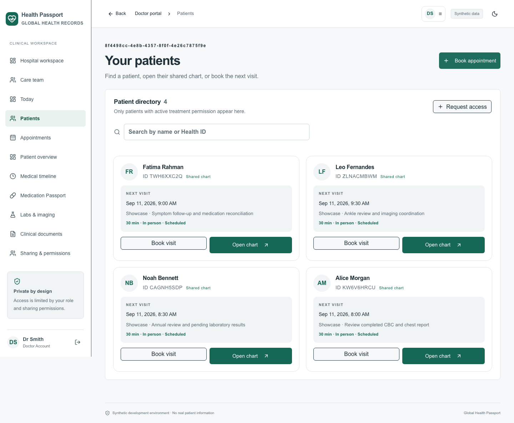
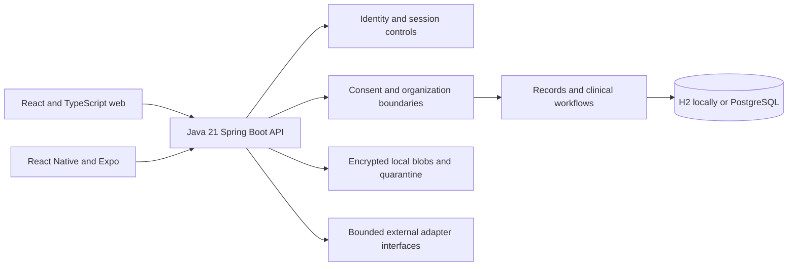
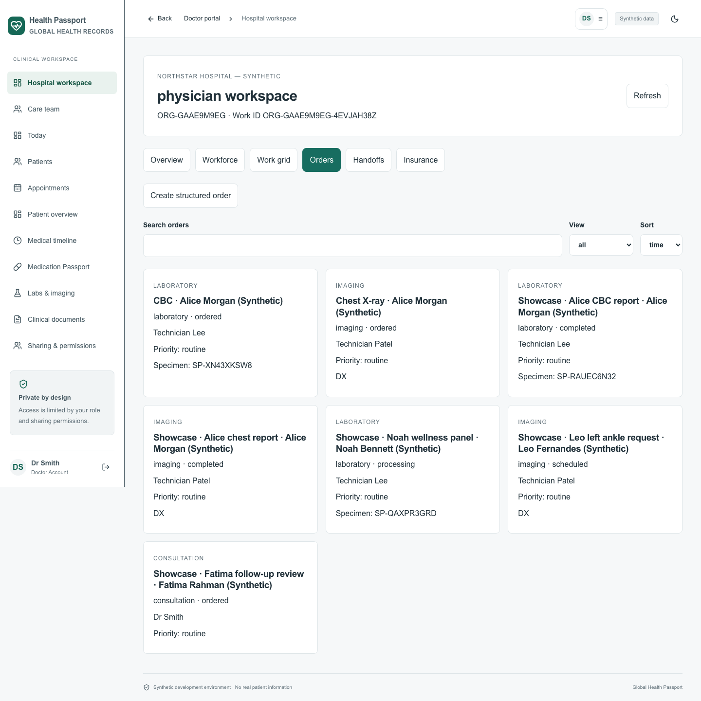

# Global Health Passport

A synthetic healthcare workflow platform connecting patient records and consent with care teams, clinical orders, and hospital operations across web and mobile clients.

**Portfolio context:** Abhijith Viswanathan directed development using AI. This repository demonstrates the resulting implementation and engineering decisions; it does not imply that every component was independently coded by its owner. It is a local prototype using fictional data, with no live-patient deployment or compliance certification.

[Architecture](docs/ARCHITECTURE.md) · [Portfolio review and current verification](docs/PORTFOLIO_REVIEW.md) · [Illustrated guide](README_USER_GUIDE.md) · [Engineering decisions](ADRs)



## Taking over development

Start with the [developer handover](docs/HANDOVER.md) for setup, code-reading order, feature ownership, API/data conventions and safe change examples. The [source map](docs/SOURCE_MAP.md) links the backend, shared logic, web/mobile workspaces and scripts. Application modules include comments explaining their responsibilities and important workflow rules.

The [public GitHub Pages demo](https://abhijithviswanathan.github.io/global-health-passport/) is a connected, fictional presentation with doctor, nurse, patient, pharmacy and laboratory perspectives. Start the nine-step Alice story to show sharing requests, nursing work, prescription directions and collection, reports, messages and follow-up. It has no backend or real login; changes last only in the current tab. See the [illustrated presenter guide](https://abhijithviswanathan.github.io/global-health-passport/demo-guide.html) and [demo walkthrough](docs/DEMO_WALKTHROUGH.md). Changing the full application does not automatically change this demo.

## What is implemented

| Area | Current scope |
|---|---|
| Patient records and consent | Source-labelled records, version history, scoped grants with expiry/revocation, access history, and bounded FHIR projections |
| Identity and access | Server-enforced roles, passkeys through a maintained WebAuthn library, TOTP, sessions and recovery flows |
| Clinician workspace | Scheduling, patient directory, encounter drafts, shared chart context and stale-write handling |
| Care teams | Clinic assignments, task dependencies and acknowledgments, independent verification, scoped conversations and care handoffs |
| Hospital operations | Organization onboarding, employment and privileges, workforce schedules, clinical work grids and public booking workflows |
| Clinical execution | Structured laboratory/imaging orders, results and review; prescription and dispensing records; nursing tasks and handoffs |
| Insurance | Encrypted patient insurance profiles, consent boundaries, a separate marketplace and a synthetic eligibility adapter |
| Documents and mobile | Encrypted document/photo storage, upload quarantine, web and Expo clients, selected expiring emergency copies |
| Bounded demonstrations | Signed medication snapshots, generic notification events and fixed synthetic learning search |

The system does not provide live insurer/EHR/PACS integration, clinical decision support, verified native-device security, or production operations. Uploads remain quarantined when the configured scanner is unavailable. See [limitations and evidence](docs/PORTFOLIO_REVIEW.md).

## Architecture



The backend is a modular monolith with JDBC and Flyway migrations V1–V18. Both clients use the shared API; selecting a portal in the UI never grants a backend role. Keeping access checks in the API supports consistent consent enforcement across clients. H2 lowers local setup cost; PostgreSQL requires separate verification of dialect and operational behavior.

**Stack:** Java 21, Spring Boot 3.5, JDBC, Flyway, H2/PostgreSQL; React 19, TypeScript, vinext/Next.js tooling; React Native and Expo; Python/OpenCV for local face-presence checking. Face presence is not identity verification or liveness detection.

## Run locally

Install Java 21, Node.js 24 with npm, and Python 3.12 or newer. First installation needs internet access. Clone the repository and run from its root:

```sh
git clone https://github.com/abhijithviswanathan/global-health-passport.git
cd global-health-passport
python3.12 scripts/dev.py --install
```

The script creates private local configuration, prepares the local photo checker, installs web dependencies, verifies/packages the backend, and starts web/API services with a persistent synthetic H2 database. The Maven wrapper downloads Maven 3.9.11 and checks its checksum. On systems where Python 3.12+ is named `python3`, substitute that command.

Open [http://localhost:5173](http://localhost:5173). The API uses port 8080. Keep both ports available; use `localhost` for the default passkey configuration. In another terminal, display your generated synthetic account credentials:

```sh
python3 scripts/configure.py --show-accounts
```

The default roles are patient, doctor, lab, pharmacy, admin and security. Credentials are generated locally and apply at initial seeding. Keep `.env`, `LOCAL_ACCESS.txt`, databases, uploads and signing keys private. The repository includes only a safe [.env.example](.env.example).

Use Ctrl+C in the launcher terminal to stop its services. Subsequent starts use `python3 scripts/dev.py`; `--no-build` reuses a packaged backend. Logs live in `.runtime/`. See [troubleshooting](docs/TROUBLESHOOTING.md) and [development](docs/DEVELOPMENT.md) for component-level setup.

## Explore a synthetic workflow

1. Sign in as a patient and inspect their Health ID and records.
2. As a doctor, request access. The request alone does not reveal the chart.
3. As the patient, approve selected categories with an expiry.
4. Create a clinical encounter and an assigned laboratory order or pharmacy prescription.
5. Use the appropriately authorized staff account to record a result or dispense event.
6. Return as the patient, inspect access history and revoke the grant; subsequent access must fail.

For richer fictional hospital fixtures, follow the [organization ecosystem guide](docs/ORGANIZATION_ECOSYSTEM.md) and [care-team guide](docs/CARE_TEAM_WORKFLOWS.md). Fixture scripts write to your local synthetic database. The screenshots below come from the included showcase fixtures; they are not real patient records.



## Mobile setup

Start the API, then in another terminal:

```sh
cd apps/mobile
npm ci
cp .env.example .env
npm start
```

Set `EXPO_PUBLIC_API_URL` without `/api`: use `http://localhost:8080` for an iOS simulator, `http://10.0.2.2:8080` for the Android emulator, or a reachable development-host address for a physical device. Device access also needs suitable host binding/firewall settings. SDKs, signing and emulator/device tools are required for native builds. See [mobile setup](apps/mobile/README.md).

## Verify

```sh
# From the repository root
cd apps/backend
./mvnw verify
```

```sh
# From apps/web
npm ci
npm run typecheck
npm run lint
npm run build
# Requires running services and a supported Playwright browser installation
npm run test:e2e
```

```sh
# From apps/mobile
npm ci
npm run typecheck
npm test
EXPO_NO_TELEMETRY=1 npx expo export --platform ios
EXPO_NO_TELEMETRY=1 npx expo export --platform android --output-dir dist-android
```

The September 11, 2026 portfolio review passed **63 local backend tests** (31 PostgreSQL cases skipped locally) and **18 mobile tests**. The [hosted run](https://github.com/abhijithviswanathan/global-health-passport/actions/runs/34668275365) then passed all backend tests with a real PostgreSQL service, web types/lint/build, and mobile types/tests on fresh runners. Current install/build results, historical browser evidence and unexecuted checks are distinguished in [the review record](docs/PORTFOLIO_REVIEW.md).

## Deployment boundary

Dockerfiles and Compose are provided as a development option. Docker execution was not repeated in this portfolio review. Real deployment needs independently reviewed infrastructure, jurisdiction-specific governance, clinical validation, HTTPS, key management, access provisioning, monitoring and recovery. Do not expose this synthetic development service as a production healthcare system.

## Explore the engineering

- [Architecture](docs/ARCHITECTURE.md), [database](docs/DATABASE.md), [API](docs/API.md), [FHIR boundary](docs/FHIR.md)
- [Threat model](docs/THREAT_MODEL.md), [security](docs/SECURITY.md), [AI boundary](docs/AI_SAFETY.md)
- [Client parity](docs/PLATFORM_PARITY.md), [test documentation](docs/TESTING.md), [full scope traceability](docs/MASTER_TRACEABILITY.md)
- [Portfolio review, contribution and interview notes](docs/PORTFOLIO_REVIEW.md)
