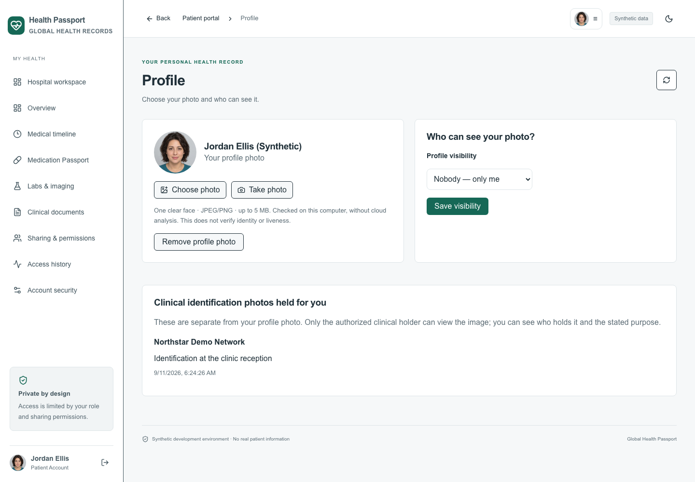
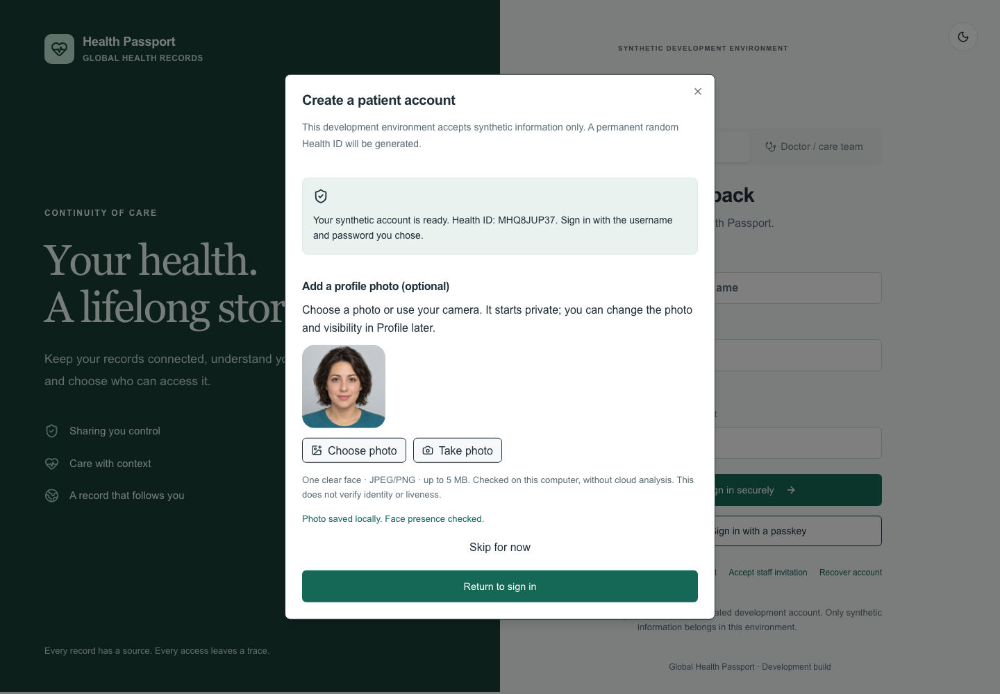
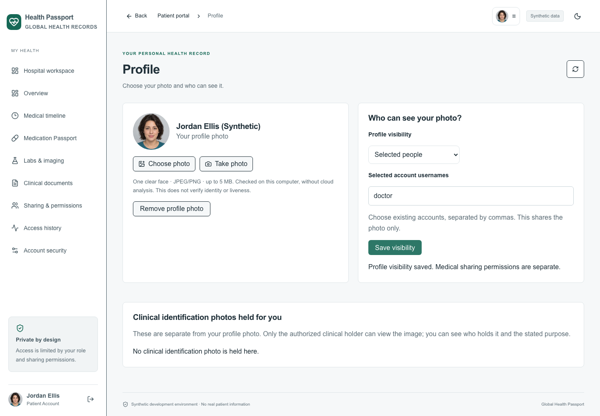
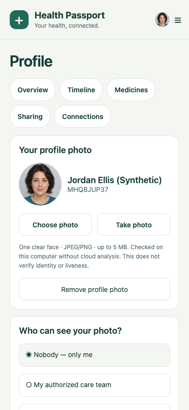
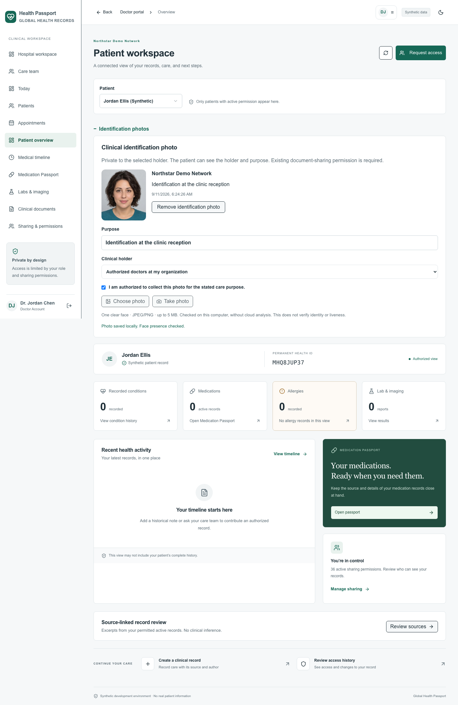
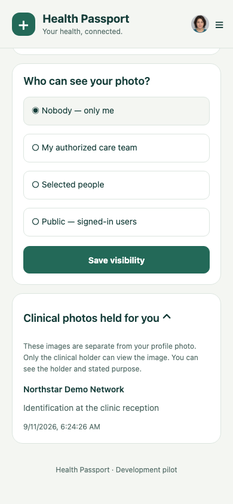
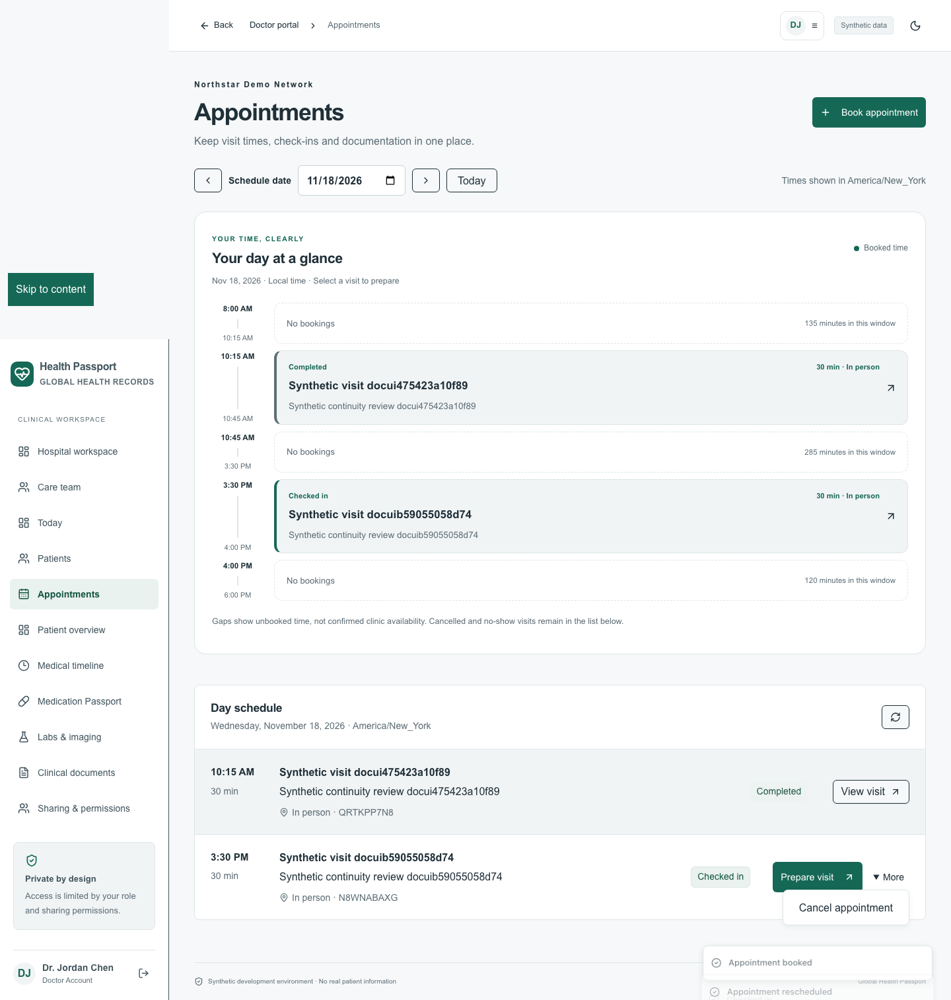
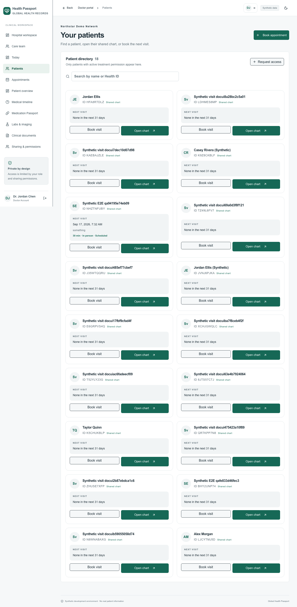

# Health Passport — your local app guide

**Updated 11 September 2026 · Web + patient and care-team mobile app**

Your project is saved on this Mac, inside `Documents/Codex/2026-09-10/files-pasted-by-the-user-master/outputs/global-health-passport`. **Desktop → Health Passport** is a shortcut to that same folder. There is one working copy; the shortcut does not duplicate or upload your data.

This build is for **synthetic testing**. Screenshots use fictional accounts and an AI-generated portrait. It has not been deployed as a live-patient service or released to an app store.

## 1. Open the app on this Mac

1. Open **Desktop → Health Passport**.
2. Double-click **Start Health Passport.command**. If the services are already running, it opens the existing app. Otherwise it starts the saved web/API builds.
3. Open [Health Passport](http://localhost:5173/). Keep the launcher's Terminal window open while using the app. Press **Control+C** there to stop services started by that launcher.
4. Read `LOCAL_ACCESS.txt` in the project folder for local test credentials. Choose **Patient** or **Doctor / care team**, then sign in with the corresponding account. The initial usernames are `patient` and `doctor`. The password is deliberately kept out of this guide.

The launcher uses the installed Java 21 and Node.js, including this Mac's bundled Node fallback when needed. It reuses saved builds; after changing source code, rebuild using section 7.

If only one service is running, the launcher asks you to stop the previous launch first instead of opening duplicate servers. Logs are saved in `.runtime/backend.log` and `.runtime/web.log`. The active development session may also have `.runtime/backend-profile.log`.

## 2. Find your way around

- **Top-left logo:** returns to the home screen for your role.
- **Back:** a small control returns to the previous section. Mobile also connects Android's Back action to the navigation flow.
- **Top-right avatar + ☰:** opens Profile & photo, Settings, access history where available, and Sign out. The web menu also includes appearance.
- **Settings → Manage profile photo:** another route to your photo and visibility choices.
- The permanent Health ID is **nine characters**. Sharing an ID does not itself grant access to records.



## 3. Patient photo: add it now or later

When you create a patient account, the next step offers **Choose photo**, **Take photo**, and **Skip for now**. Skipping still creates the account. You can return through **Profile & photo** whenever you want.

Choose a JPEG or PNG under 5 MB with one clear face. A well-lit, front-facing portrait works best. The web camera needs permission and either localhost or an HTTPS site. Mobile asks for camera or photo-library access through the operating system. Denying permission leaves photo selection optional; you can use the other source or continue without a photo.



Uploaded images are normalized to JPEG, resized to at most 1,024 pixels on the longest edge and stripped of source metadata by the server. Input dimensions are limited to 20 megapixels. The **YuNet face-presence model runs on your local API computer**, with no cloud image-analysis request. It checks for a single sufficiently visible face. It does **not** establish identity, authenticity or liveness, and can make mistakes. A generated portrait can pass. A photo is never a login credential or a replacement for identity checks.

If the checker is unavailable, the app reports that and does not accept the photo unchecked. Skip the step and try later. Upload attempts are limited to five per account in 15 minutes.

### Choose who can see the profile image

Your first photo starts with **Nobody — only me**. Select an option and press **Save visibility**:

| Choice | Who can view the profile photo |
|---|---|
| Nobody — only me | You |
| My authorized care team | Verified care-team accounts with an active treatment-sharing grant |
| Selected people | The existing account usernames you enter, separated by commas; up to 50 |
| Public — signed-in users | Authenticated accounts with your profile reference; never anonymous internet visitors |

“Selected people” is a username allowlist, not a separate social/friend network. Changing photo visibility **does not share medical records**. A profile URL alone cannot bypass these rules. Both photo metadata and image endpoints check server permissions. Open screens refresh photo access periodically; an image someone already viewed cannot be recalled from their memory or screenshots.





Use **Remove profile photo** to delete your current profile image. Choose or take another photo to replace it. Only one current profile photo is retained by the app; separately managed backups may still contain older data.

## 4. Private doctor or hospital identification photos

These images are separate from the patient's chosen profile picture. Changing a profile picture or making it private does not replace a clinical identification photo.

1. Sign in as a verified doctor and open **Patients → Open chart**.
2. Open **Identification photos**. The patient must have an active treatment grant that includes **Uploaded documents / document** for that doctor.
3. Enter a clear purpose, such as “Identification at clinic reception.”
4. Select **Only me as the treating doctor**, or **Authorized doctors at my organization**. On mobile, use the organization-holder switch.
5. Confirm authorization to collect the photo for that purpose, then choose or take the image.

For an organization-held photo, another doctor must belong to the same organization **and** have their own current document-sharing permission for the patient. An administrator role alone does not grant image access. With doctor-only scope, another doctor at the same hospital still cannot view it. Revoking the relevant grant blocks subsequent retrieval. Each holder has one current image per patient; an authorized replacement removes the old active image.



The patient can see **which holder has a photo, its stated purpose and the date** under Profile & photo → Clinical photos held for you. The private image itself is not returned to the patient. Authorized clinical holders can remove their images. This pilot does not add a patient deletion-request workflow or hospital reception-staff role; hospital photo handling currently uses authorized doctor accounts.



## 5. The doctor's working day

**Today** brings together the day's appointments, visit status and next actions. **Agenda / Appointments** shows a timestamped schedule with visit start/end times and unbooked intervals. An unbooked interval is not a declaration of doctor availability. Cancelled and no-show visits are identified, and midnight-crossing visits are clipped into the selected day. Times follow the device/browser timezone.

**Patients** uses cards with name, short Health ID, authorized chart access and the next appointment within 31 days. Cards group the reason, duration, mode and status when available. Use **Open chart** for source records and **Book visit** to schedule. The backend rejects overlapping bookings.





Open a visit to review shared context and write a SOAP draft. You can explicitly reuse the visit reason and use the writing guide. **Save draft** stores it on the local server so either client can resume it. Conflicting edits from another device require a reload and review. **Complete visit** requires a review confirmation and files one encounter once; repeated completion does not create duplicates. Save before navigating away or backgrounding the mobile app. Menu navigation and sign-out also respect unsaved-visit checks.

## 6. Where everything is stored

| Item | Default location in this project |
|---|---|
| Source, guides and screenshots | This project folder |
| Local accounts, records, consents, appointments, photo policies and holder metadata | `apps/backend/data/passport.mv.db` |
| Encrypted profile and clinical photo files | `apps/backend/data/photos/*.enc` |
| Encrypted uploaded documents | `apps/backend/data/documents/` |
| Local configuration and encryption keys | `.env` — keep private |
| Local signing material and generated seed credentials | `apps/backend/data/` |
| Runtime logs and copies of active API builds | `.runtime/` |
| Local face-check software and model | `apps/backend/photo-check/` |

Photo files use AES-256-GCM with a random IV and the photo ID bound as authenticated data. The key comes from `DOCUMENT_ENCRYPTION_KEY`. On this Mac the photo directory is owner-only and files are owner-readable/writable. Processing briefly creates a normalized local JPEG in that protected directory; normal success and failure paths remove it. A process crash can leave temporary files. Encryption of photo blobs does not imply whole-database or whole-disk encryption.

Neither client writes a full clinical-record cache. Mobile keeps displayed photo data in memory and attempts to remove its own temporary picker copies; it does not delete originals from your photo library. Its separate, explicit biometric emergency-summary feature retains only selected bounded records. Normal mobile backgrounding hides and clears clinical screens. While the user-requested system photo picker is open, the screen is hidden and its task stays mounted so selection can finish. Native background snapshots and cache deletion still need device verification.

### Back up and restore

For the default H2 setup, stop the API before copying its database. Back up **`.env`, the entire `apps/backend/data` directory, and the source/guide folder together** to a protected local drive. Losing the encryption/signing keys can make encrypted files or credentials unusable. Do not put a private backup or `.env` into a public repository or public cloud folder.

To restore, stop services, preserve the current copy, restore the matching database/files/keys, then start the compatible application version and verify login, photo retrieval and document access. A pre-photo migration database backup is in `.runtime/pre-photo-migration`; it is a rollback aid, not a backup of subsequent photo uploads. Do not run older application code against a newer schema without a reviewed restore plan.

## 7. Install or rebuild on another computer

Install **Java 21, Node.js 24 with npm, and Python 3.12 or newer**. On this Mac the system `python3` is 3.9, so choose the newer interpreter explicitly. The existing face-check environment uses Python 3.12. Do not copy a virtual environment to a different machine; recreate it.

From the project root, using your Python 3.12+ executable:

```sh
python3.12 scripts/dev.py --install
```

This verifies the bundled model checksum, installs the local OpenCV checker, installs web dependencies, builds/tests the Java API, applies database migrations and starts the web development server. First dependency installation needs internet access; processing photos does not. The checked-in Maven wrapper downloads Maven and verifies its checksum. Existing `.env` values are preserved.

To build saved artifacts after changing source:

```sh
cd apps/backend
./mvnw verify
cd ../web
npm ci
npm run lint
npm run typecheck
npm run build
cd ../..
python3 scripts/start_saved.py
```

If the photo checker needs repair, run `python3.12 scripts/setup_photos.py`. The model and its MIT license are included. Optional environment overrides are `PHOTO_STORAGE_PATH`, `PHOTO_CHECK_PYTHON` and `PHOTO_CHECK_SCRIPT`; paths are resolved from the backend working directory. Use absolute paths when running it from a service manager.

## 8. Run the mobile application

Keep the same backend running. From `apps/mobile`:

```sh
npm ci
cp .env.example .env
npm start
```

Set `EXPO_PUBLIC_API_URL` to the API origin, without `/api`: iOS simulator uses `http://localhost:8080`; Android emulator uses `http://10.0.2.2:8080`. A physical phone needs the computer's reachable private LAN address and an explicitly configured backend bind address, or an approved HTTPS development service. Do not expose the local synthetic server to the internet merely to connect a phone. Release-mode requests require HTTPS.

For native builds use `npm run ios` with Xcode/CocoaPods, or `npm run android` with an Android SDK/emulator/device. Camera/library permission messages are included in the Expo configuration. iOS Face ID requires an appropriate development build. Set real application IDs, signing and service origins before distribution.

The app at [localhost:5174](http://localhost:5174/) is the **actual mobile interface rendered in a browser test harness**. Its file picker, biometrics, secure storage and confirmation dialogs have explicit test substitutes. It is useful for UI and shared-API checks, but is not an installed iOS or Android app. The screenshots in this guide with mobile layouts come from that harness.

## 9. Deploy a synthetic test environment

The supplied `compose.yaml` runs PostgreSQL, the Java API and the web frontend in containers. It keeps persistent database and encrypted-file volumes on the Docker host. Docker is not installed on this Mac, so this revised container build has **not been executed here**.

```sh
python3 scripts/configure.py
docker compose up --build
```

Open `http://localhost:5173`. The web service is bound to loopback. Use `docker compose down` to stop; do not add `-v` unless you intend to delete its data volumes. Back up both named volumes and matching keys. Container storage is independent of the default H2 files; Compose does not import your H2 data automatically.

The API image includes Python/OpenCV, the local YuNet model and an encrypted-photo data volume. The web image includes the shared agenda module. The web camera policy allows same-origin camera use, while microphone access remains disabled.

For a remotely accessible service, put a maintained HTTPS reverse proxy in front, set secure cookies and exact WebAuthn origins/RP ID, keep PostgreSQL/files private, use managed secrets and restore-tested backups, provision verified staff, and review the existing [deployment requirements](docs/DEPLOYMENT.md). A frontend-only host does not run the Java API. Real-patient release also requires the identity, security, clinical, legal, operating and native-device work recorded in the [delivery report](DELIVERY_REPORT.md). These instructions do not claim that work is completed.

## 10. Verification and future changes

Final results: **35 backend tests passed**, plus **4 separate PostgreSQL photo tests**, **9 standard web journeys**, **2 photo/cross-client journeys**, **3 mobile clinician journeys**, and **18 mobile policy/transport tests**. The default backend run skipped 7 optional PostgreSQL workflow cases; the separate photo database run tested V1–V12 and its four photo cases. Web static checks, both native JavaScript exports, and the saved launcher's cold start passed. The updated mobile dependency audit reported zero vulnerabilities.

The delivered verification evidence is in [photo feature verification](docs/evidence/profile-photo-verification.json) and [cross-platform parity](docs/PLATFORM_PARITY.md). It distinguishes real local API tests, browser journeys, the actual local model checks and mobile bundle exports. Native compilation, physical cameras, OS privacy snapshots, signing and store distribution remain unverified on this host.

Your standing instruction is recorded in `AGENTS.md`: **future user-facing changes apply to web, mobile and the shared API; ask you before modifying README files for subsequent changes.** This initial illustrated guide is part of the work you authorized now.

Model references: [OpenCV YuNet model](https://github.com/opencv/opencv_zoo/blob/main/models/face_detection_yunet/README.md), [MIT license](https://github.com/opencv/opencv_zoo/blob/main/models/face_detection_yunet/LICENSE), and [OpenCV FaceDetectorYN](https://docs.opencv.org/doc/doxygen/html/df/d20/classcv_1_1FaceDetectorYN.html).

## 10. New care-team workflows

Doctors, nurses, reception, laboratory/diagnostic staff, coordinators, administrators and pharmacy staff now have shared care workspaces on web and mobile. Read [Care team workflows](docs/CARE_TEAM_WORKFLOWS.md) for the illustrated walkthrough, staff entry points, record dates and sources, tasks, messaging, appointment stages, and result review.

The guide also explains what remains local or unconnected: in-app notifications do not send email/SMS/push, internal orders do not reach external laboratories, and native device validation is still required. The Desktop working-folder shortcut points to these updated files; the dated September 10 backup remains a historical snapshot.


## Hospital ecosystem expansion — September 11

The saved local application now includes organization onboarding, separate staff identities, workforce schedules, clinical work grids/orders, nursing/handoffs, patient insurance and a separated insurer marketplace in both clients. Start with the [illustrated workflow and account guide](docs/ORGANIZATION_ECOSYSTEM.md). The current password remains in the root LOCAL_ACCESS.txt; new hospital usernames start with `hospital`. Existing accounts and local records are preserved.

This remains a synthetic pilot. Live insurer/PACS integration, production MFA provisioning, clinical/legal approval and physical native-device verification are not implied by a successful local build.
