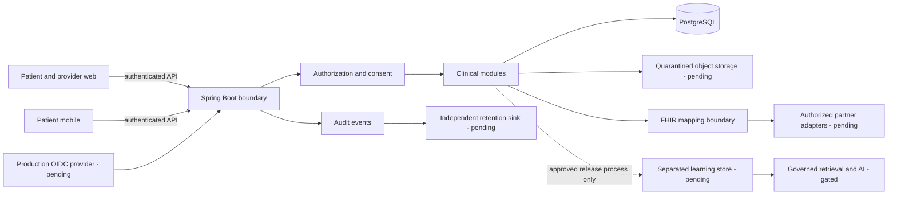

# Architecture

## Selected direction
Java/Spring Boot modular monolith, PostgreSQL transactional store, React/TypeScript web and React Native/Expo patient client. H2 is limited to disposable synthetic development/tests. The web uses the Sites vinext starter; this differs from a conventional Next.js deployment and does not change the backend authorization boundary. See ADRs for reasons and tradeoffs.

## Trust boundaries and data flow
Clients are untrusted. Health ID and QR identify a subject; neither authorizes reads. Each request authenticates the actor, derives organization/role, resolves the requested resource, evaluates patient relationship and active consent/category/purpose, minimizes the response, then records disclosure. Resource authorization must occur before attachment URLs, FHIR serialization, exports and search snippets are produced.

The initial process and database are shared: package separation is maintainability, not an isolation claim. Production service accounts need module-specific table privileges or extracted services where a strong boundary is necessary. Identity/PII, security, clinical, consent, laboratory, imaging metadata, pharmacy, audit, secondary cases, search, retrieval, analytics and notifications need explicit data ownership. Secondary-use and AI indexing must never have general transactional database credentials.

## Identity and consent
Public Health ID uses random material distinct from internal keys. The production target delegates federation/lifecycle to a maintained OIDC provider. The current build implements passkeys using a maintained WebAuthn library and TOTP using a maintained OTP library; it does not imitate undocumented authentication systems. Local synthetic credentials or identity selection are development affordances and must be disabled by deployment configuration before live data. Consent grants are server-side records, not client assertions. Grants define actor/organization, categories, purpose, start, expiry and revoked state. Revocation must invalidate pending exports and cached authorization results.

## Clinical provenance
Store original author, organization, original partner identifier/version, clinical time and recorded time separately. Display patient-entered records with unverified provenance. Amendments append history. Provider legal records, patient-controlled sharing, platform copies and approved learning releases have different retention and control semantics.

## Scaling and extraction
Start with one region, bounded connection pools, pagination and explicit indexes. Add stateless backend replicas once sessions and rate limits are shared. Add workers using a transactional outbox for notifications, scanning and imports; retries require deduplication. Partition audit/time-series tables when measured growth warrants it. Redis, dedicated search, vector databases and Kubernetes require measured need. Cross-region PHI replication is blocked pending regional policy and contracts.

## Current architecture limitation
A runnable development bundle cannot establish production separation, KMS, protected audit retention, OIDC lifecycle, trusted clinical signing authority, backup recovery or partner interoperability. The source-of-truth and test reports identify actual implementation evidence; this document defines the destination and boundaries.

Implemented bounded modules now include encrypted TOTP/recovery/session registry, maintained-library WebAuthn, encrypted file quarantine, local signed medication credentials and immutable synthetic-case search/source excerpts. These do not establish external identity verification, malware-scanner effectiveness, production key custody or clinical validation.
