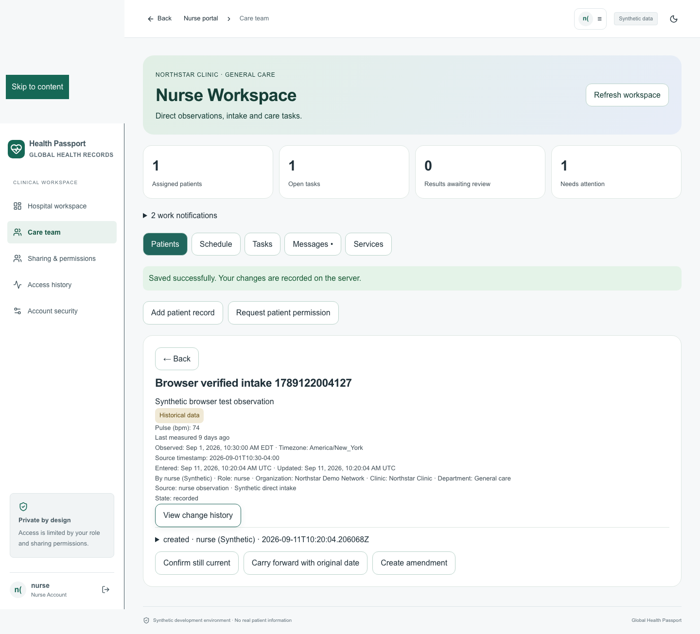
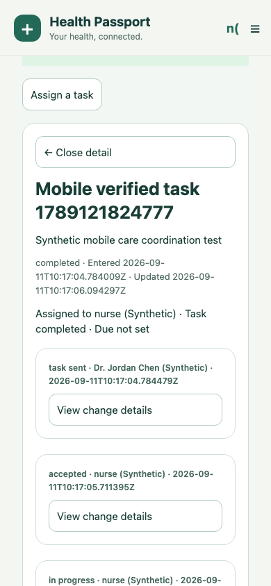
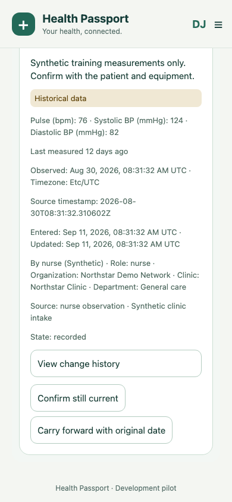

# Care team workflows — September 11, 2026

This revision runs locally in the existing app, with shared server records across the web client and native mobile components. Use synthetic data only. No external messages, real clinical orders, or patient notifications are sent by the walkthrough.

## Where to work

| Role | Web | Mobile | Main work |
|---|---|---|---|
| Doctor | Sign in → Care team; Today and Appointments remain available | Sign in → Care team workspace; Doctor home returns to the original agenda | Shared patient timeline, notes, orders, result review, tasks and conversations |
| Nurse | Opens Nurse workspace | Opens Nurse workspace | Assigned patients, direct vitals, histories, nursing observations, triage and accepted care tasks |
| Reception | Opens Reception workspace | Opens Reception workspace | Register an existing Health ID at the clinic, book appointments and check patients in |
| Lab | Opens Lab workspace → Services | Opens Lab workspace → Services | Assigned requests, specimen states, linked results and clarification requests |
| Diagnostic staff | Opens Diagnostic workspace → Services | Opens Diagnostic workspace → Services | Imaging requests, examination states and reports |
| Coordinator | Opens Coordinator workspace → Access | Opens Coordinator workspace → Access | Clinic assignments, registration, scheduling, operational tasks and escalation notices |
| Administrator | Opens Admin workspace → Access, including verification | Opens Admin workspace → Access, including verification | Staff accounts, suspension, departments, patient assignments and clinic freshness intervals |
| Pharmacy | Opens Pharmacy workspace; Medication Passport remains available | Opens Pharmacy workspace → Services / Patients | Linked prescriptions and dispensing records using the existing recipient/refill checks |

The selected sign-in tab never assigns a role. The server uses the authenticated account, verified practitioner status, active membership, clinic assignment and patient consent.

## Try the synthetic walkthrough

The local test setup creates a separate account, `carepatient`, for Casey Rivera, and leaves existing patient records intact. Staff usernames are `doctor`, `nurse`, `reception`, `lab`, `diagnostic`, `coordinator`, `admin`, and `pharmacy`. Their local development password is in `LOCAL_ACCESS.txt`. On a fresh demo installation, run `python3 scripts/setup_care_demo.py` after starting the app. The script refuses to run outside `DEMO_MODE=true` and does not reset existing account passwords.

1. Sign in as **nurse** and select Casey. Open **Previous intake vitals**. The original observation time is separate from the entry time, and the old measurement is labelled **Historical data**.
2. Choose **Add patient record → Vital**. Enter the measured values using the displayed units, the actual observation date/time with offset, source type and source details. Unknown times stay blank. Save, then open the record to inspect authorship.
3. Sign in as **doctor**, open **Care team → Patients**, and select Casey. The nurse's saved reading is the same record. **Carry forward** retains the original observation, source and measurements. **Confirm still current** records a separate confirmation and does not remeasure a vital.
4. Under **Tasks**, open **Complete intake review**. A doctor can send instructions, but the assignee must accept the task. As nurse, move through **accepted → in progress → completed**; record a comment at each step. The doctor can see the resulting status and history.
5. Under **Messages**, open **Casey · care discussion**. Mentions and unread indicators are separate from task acceptance. A doctor may explicitly review a message and record a clinical decision; chat alone is not filed as a clinical note.
6. As **lab**, open **Services → Synthetic laboratory request**. Accept, collect a specimen, and mark processing. Use **Patients → Add patient record → Lab result**, select the same patient and related order, and record the result's actual observation time and laboratory source. Return to the order and mark **result posted**. The doctor can then review the result in Services.

## Connect an additional patient

1. The patient creates their own account first, preserving the existing identity and optional photo flow.
2. Reception uses **Register existing patient at clinic**, with the short Health ID supplied by the patient. This creates a registration relationship and does not grant clinical access.
3. A coordinator or administrator uses **Access → Assign patient access**, selects the staff account, supplies the patient's Health ID, chooses specific scopes and an expiry. Updating an existing assignment requires its latest version, visible under **View clinic assignments**.
4. Clinical staff use **Request patient permission**. The patient approves the relevant scopes in **Sharing & permissions** on web or through the mobile request approval flow. Both assignment and consent are required for care-managed patients; granting one does not replace the other.
5. Existing consent-only records keep their earlier workflow until that patient enters clinic assignment management. New nursing and diagnostic access always requires a clinic assignment.

Reception receives registration and schedule information, without general access to clinical notes or record contents. Joining a conversation does not bypass the patient's clinical permissions. Cross-clinic conversation membership is rejected in this implementation; it is not an external collaboration gateway.

## Appointment to discharge

Book the patient with an assigned doctor. Reception moves the appointment to **checked in**; a nurse or doctor performs **triage** and records vitals. The doctor advances to **consultation**, writes a linked encounter note and reviews/signs it. Signing a linked encounter completes the shared appointment, which is also reflected in the original doctor agenda. The doctor can then move the encounter to **follow-up** and **discharged**, adding linked follow-up, referral or discharge records and tasks as appropriate.

The system rejects out-of-order stages, overlapping doctor appointments, stale versions, unauthorized completion and repeat filing. Scheduled appointment time is labelled as scheduled time; it is not silently used as the observation time of a clinical finding.

## Dates and corrections

- Observation date/time is supplied by the source, with its UTC offset and optional named timezone. Missing historical values remain unknown.
- Entry and update timestamps come from the server. New records capture the entering person's role, organization, clinic and department at entry.
- Historical imports and carry-forward records keep the old observation/source. Record age and per-type freshness labels are displayed independently from confirmation.
- Freshness intervals are operational display settings, not medical advice. Administrators override them per clinic; templates do not change other clinics.
- Unsigned doctor notes use optimistic versions. The author can save or sign a reviewed draft. Signed content is corrected by an amendment with a reason, preserving the previous record and its signed content.
- Existing records receive a migration snapshot. This cannot reconstruct edits, historical roles or observation dates that the old application never captured.
- Change-history endpoints are read-only. Ordinary application users cannot delete revisions. Database-owner access still requires operational controls; this does not claim immutable external audit storage.

## Communications, attachments and notifications

Tasks accept an individual assignee or a clinic department team, patient/encounter linkage, priority, due time and acknowledgment deadline. The first authorized team member accepting a team task becomes its assignee. Blocked tasks can return to in-progress. Comments and revisions preserve the sequence of actions.

Attachments are references to existing patient records, including uploaded-document entries; their patient and scope must match the conversation or task. Upload and malware quarantine remain in the existing document workflow. Native binary document handling has not been added here.

Notification previews contain generic text, not patient names or clinical content. Open work that is overdue or has missed its acknowledgment deadline produces an escalation notice for the creator/assignee and clinic coordinators/administrators. These are in-app notices derived from persisted records, refreshed on opening/refreshing workspaces. Web also refreshes notification counts while the workspace is open. No email, SMS, operating-system push, or background delivery is configured.

## Remaining boundaries

- No external EHR, laboratory, imaging/PACS, calendar, pharmacy delivery, billing or insurer connector is configured. Internal orders/results and dispensing are stored and linked; submitting them does not send a real-world order.
- The existing project has no inpatient bed-management or billing subsystem to connect. Discharge is a linked encounter stage and record, not an inpatient admission/discharge engine.
- Department-specific case-sheet template authoring is not part of this revision; histories and notes currently use text sections plus structured vital fields.
- New clinical staff accounts require administrator verification before clinical use (Access → select the member → Review clinical staff verification, on either client); production MFA requirements remain in place. Staff self-sign-up does not grant clinical roles.
- Native iOS/Android JavaScript exports and browser-rendered native components are checked separately. Native hardware, secure-cookie behavior, OS push, biometrics, backgrounding, signed app binaries and app-store release require device validation.
- The project remains local and synthetic. These checks do not certify readiness for real patient deployment.

## Verification for this revision

Passed: 45 H2 backend tests, 10 PostgreSQL care-workflow tests, 11 web journeys, five browser-rendered native journeys and 18 mobile policy/transport tests. Both type checks, web lint/format/build and iOS/Android Hermes exports passed. Screenshots above show the implemented screens with synthetic data. The older seven PostgreSQL tests and the separate photo-browser suite were not rerun in this revision. See [the verification report](evidence/care-coordination-verification.json) for precise coverage and limitations.
