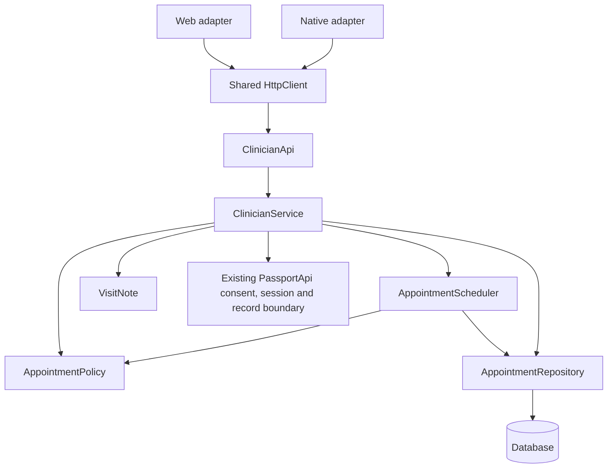

# Code architecture and contribution guide

Updated 26 September 2026. This guide describes the current refactor and where a coworker should extend it. See [handover](HANDOVER.md) for installation and [verification](REFACTOR_VERIFICATION.md) for executed checks.

## Responsibilities and dependencies

| Area | Responsibility | Start here |
| --- | --- | --- |
| Clinician HTTP adapter | Resolve the server session, check CSRF, map routes | `apps/backend/.../ClinicianApi.java` |
| Clinician service | Coordinate consent, versions, booking, draft and completion use cases | `ClinicianService.java` |
| Appointment repository | Parameterized SQL, row locks and draft persistence | `AppointmentRepository.java` |
| Appointment policy and scheduler | Pure time/state rules; coordinate workforce availability and overlap checks | `AppointmentPolicy.java`, `AppointmentScheduler.java` |
| Visit note value object | Validate and format immutable SOAP sections | `VisitNote.java` |
| Shared transport | Serialize requests, cancellation, timeout, response/error handling | `apps/shared/http-client.ts` |
| Platform adapters | Browser/native cookies, token lifecycle, field naming and release HTTPS rule | `apps/web/lib/api.ts`, `apps/mobile/src/api.ts` |
| Shared form builders | Describe fields, choices, fixed context and payloads for both clients | `apps/shared/care/`, `apps/shared/ecosystem/` |
| Patient presentation | Render reusable controls and record cards without owning sessions | `apps/web/components/patient/`, `apps/mobile/src/patient/` |
| Public demo model | Own fictional per-tab state and execute commands atomically | `docs/demo/model.mjs`, `docs/demo/workflow/` |
| Public demo controller/views | Route DOM events, navigate, present dialogs and render snapshots | `docs/demo/ui/` |



The public GitHub Pages demo is a separate, static application. It does not call these authenticated services. Its flow is:

```text
app.mjs composes DemoApplication
  DOM action -> controller -> DemoModel -> WorkflowEngine
    -> one command -> WorkflowTransaction draft -> commit
  model snapshot + navigation snapshot -> pure view functions -> HTML
```

## Patterns used and why

**Service and Repository:** the clinician controller no longer embeds SQL or encounter orchestration. The service coordinates a use case; the repository only persists/query data. Consent is checked by the service through the existing core, never inferred by a repository or UI.

**Dependency injection:** Spring injects clinician collaborators. `AppointmentPolicy` accepts a clock in tests, so exact booking boundaries are deterministic. The demo accepts an engine/model/navigation implementation, and `HttpClient` accepts fetch and response strategies. Dependencies are explicit constructor arguments; there is no service locator or new dependency-injection library.

**Strategy and Adapter:** `CachedCsrfPolicy` preserves browser token reuse; `FreshCsrfPolicy` preserves native per-write tokens. The platform adapters keep their public signatures and naming conventions. The shared transport does not retry clinical writes automatically. A failed or stale write returns control to the screen for review.

**Command and Unit of Work:** demo commands are registered by action name and grouped by clinical story. Each receives a detached transaction draft containing state, events and notifications. The engine publishes that draft only after validation succeeds. This is simulated atomicity in memory, not a database transaction or real access control.

**Value object:** `VisitNote` represents four validated, immutable SOAP sections and formats the existing encounter text. It does not diagnose, infer findings or change signing requirements.

**Facade and composition:** `care-model.ts`, `ecosystem-model.ts` and demo `store.mjs` retain stable exports while delegating to focused feature modules. Ordered form factories retain existing button order. React components remain functions with props and hooks; classes are used for stateful services and lifecycle ownership, not imposed on every rendering function.

## Rules for new code

- Give each module a concrete responsibility. Prefer explicit names, small use cases, early validation and constructor/prop injection over global mutable state.
- Compose behavior before adding inheritance. Add an interface when there is a real alternative implementation or test boundary; avoid generic base controllers and one-method wrapper hierarchies.
- Keep I/O out of presentation and pure policy code. Shared form definitions describe actions; server authorization remains mandatory even if a button is hidden.
- Explain the reason for locks, scope checks, cache invalidation, version checks and platform differences in comments. Do not narrate obvious assignments or add a comment to every line.
- Keep public API shapes stable during extraction. A deliberate change to status, field names, payloads or error behavior needs updated callers and regression coverage.
- Preserve caller-owned request keys. Do not generate a new key on a retry or introduce automatic retries of prescription, appointment or record writes.
- Keep the existing actor-resolution monitor and database transaction/doctor-row-lock boundary intact. Moving a query to a repository does not make it safe outside that transaction.
- Use plain data for shared form contracts, source-labelled observations and immutable values. Type legacy row maps at the boundary incrementally; do not silence new type errors with `any` or casts.
- Keep patient and session generation guards in the web/native shells. Presentation extraction must not change background privacy, biometric unlocking, consent refresh or stale-response handling.
- Use the existing formatter and `.editorconfig`. Do not reformat dependencies, vendored controls or applied migrations. No runtime dependency was added by this refactor.

## Example: extend a workflow

For a care task, start with `apps/shared/care/actions/tasks.ts`; for nursing execution, start with `apps/shared/ecosystem/actions/clinical.ts`. Add the field/action there, and use `care/forms.ts` for serialization. Update server validation/persistence independently. Both care workspaces consume the same facade exports. Check valid, unauthorized and stale submissions, and inspect both clients.

For a simulated demo action, add a handler to the relevant `docs/demo/workflow/commands/` module and register it through that module's command map. Validate role/scope/state before changing the draft; record events and notices through the transaction. Add the UI input/review in `ui/application.mjs` and output in the corresponding `ui/views/` module. Test success and rejection without partial changes. The public fixtures must remain fictional.

For an appointment rule, use `AppointmentPolicy` for pure decisions and `AppointmentScheduler` when workforce or database access is necessary. Keep the caller's transaction and doctor lock around availability checks and insertion. Keep repeat-safe booking and optimistic version checks in the service; changing SQL alone is insufficient.

## Verification commands

From the repository root after installing web and mobile dependencies:

```sh
node --test scripts/tests/*.test.mjs
node apps/web/node_modules/eslint/bin/eslint.js --config scripts/quality/demo-eslint.config.mjs docs/demo
node apps/web/node_modules/eslint/bin/eslint.js --config scripts/quality/shared-eslint.config.mjs apps/shared --max-warnings 0
(cd apps/web && npm run typecheck && npm run lint && npm run build)
(cd apps/mobile && npm run typecheck && npm test && npm run export)
(cd apps/backend && ./mvnw -B --no-transfer-progress verify)
```

The local Java suite skips PostgreSQL-specific tests unless `TEST_DATABASE_URL`, `TEST_DATABASE_USER` and `TEST_DATABASE_PASSWORD` are configured. GitHub CI supplies a disposable PostgreSQL service and runs those tests. The [demo walkthrough](DEMO_WALKTHROUGH.md) and [mobile browser harness](../apps/mobile/tests/browser/README.md) explain UI checks. Exports and browser harnesses do not establish native-device behavior.

## Remaining architecture work

This is an incremental refactor, not a claim that every legacy module is now fully layered. `PassportApi`, `CareApi` and `EcosystemApi` still combine some orchestration and persistence. Web/native shells still own coupled session and form lifecycles, and legacy JDBC rows remain map-shaped. Further extraction should follow feature boundaries, with characterization and authorization tests first. Avoid a broad rewrite solely to reduce line counts; preserve data and concurrency contracts throughout.
