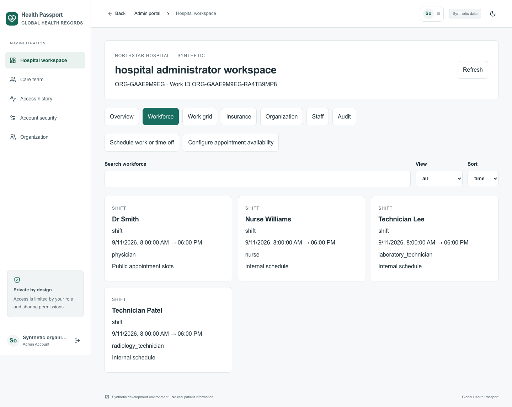
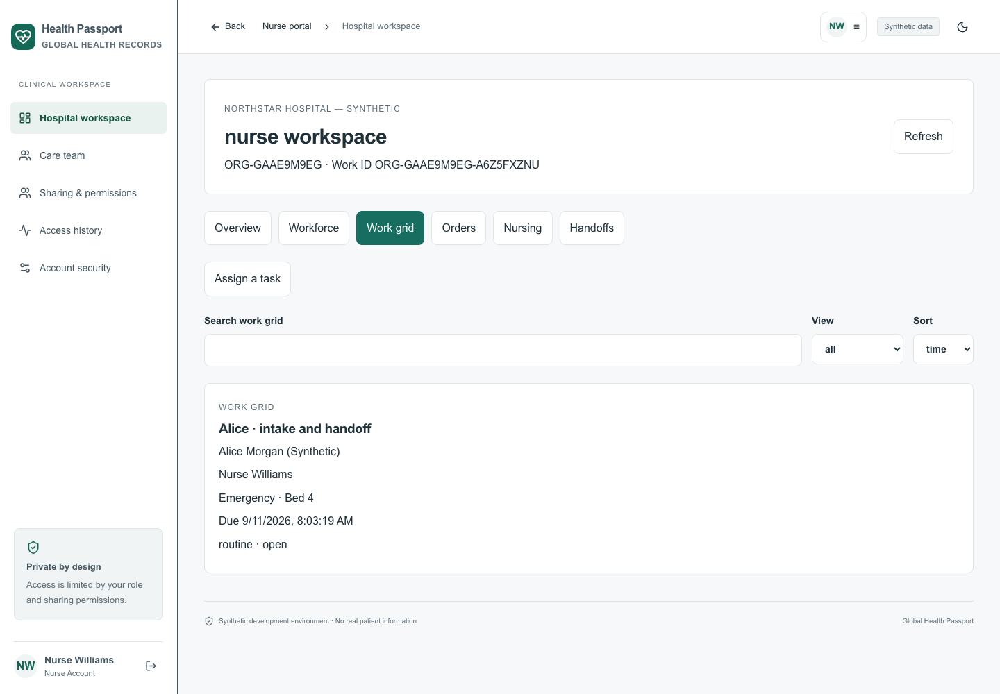
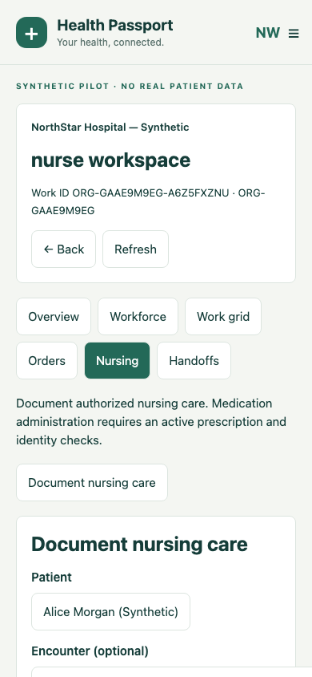
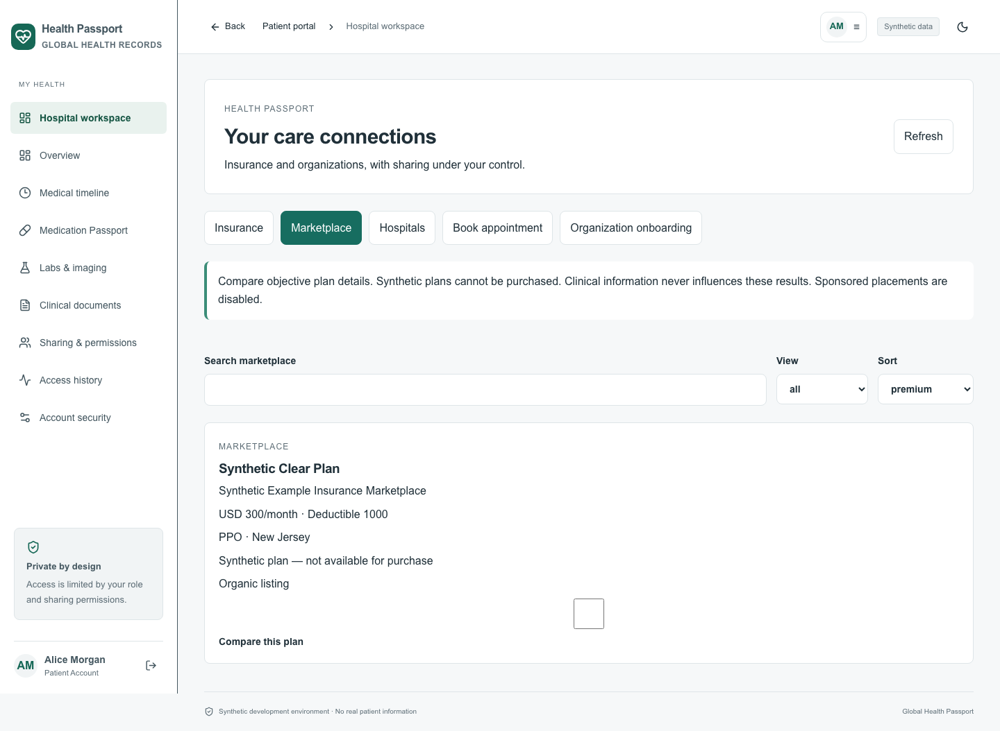
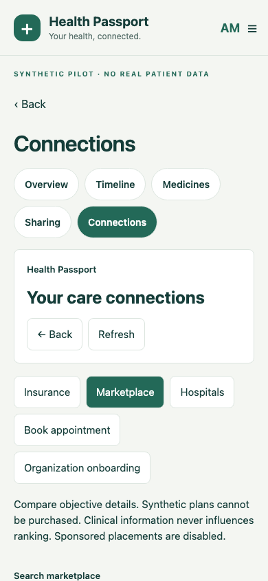

# Organization ecosystem — implementation and illustrated guide

This expansion continues the existing Java modular backend, persistent local database, web client and React Native app. All walkthrough data is synthetic. No real hospital accreditation, insurance verification, clinical suitability, production deployment or device certification is implied.

## Start and sign in

Open **Start Health Passport.command** in the project (also available through Desktop → Health Passport). The saved web application is at http://localhost:5173. Keep the launcher running. The mobile browser harness is http://localhost:5174 when separately started; it is the React Native UI with substituted device APIs, not an installed iOS/Android app.

Use the current demo password in `LOCAL_ACCESS.txt`. Work IDs identify employees; they never substitute for a password or a second factor.

| Username | Workspace |
|---|---|
| hospitaladmin | Hospital administration, departments, staffing, audit |
| hospitaldoctor | Dr Smith: today, appointments, patients, tasks, orders |
| hospitalnurse | Nurse Williams: authorized patients, nursing, tasks, specimens, handoffs |
| hospitallab | Technician Lee: assigned lab orders and results |
| hospitalimaging | Technician Patel: imaging workflow and report draft |
| hospitalradiologist | Radiologist: reviewed report attestation |
| hospitalpharmacy | Prescription verification and dispensing |
| hospitalreception | Registration and appointment scheduling |
| hospitalbilling | Explicitly shared insurance and eligibility |
| hospitalinsurer | Marketplace plan submission; no clinical chart access |
| hospitalalice | Alice: own timeline, hospitals, insurance, sharing and marketplace |
| security | Original synthetic platform reviewer; organization/plan review |

The original doctor, patient, nurse and other care-team accounts remain available. Staff may use the care-team sign-in entry. Server identity controls their role regardless of the selected login tab.

## Organization and staff setup

A signed-in patient can open Hospital workspace → Organization onboarding (mobile: Connections). Request a hospital, clinic, lab, diagnostic center, pharmacy, group or insurer organization with a separate work administrator account. It begins pending. An independent platform reviewer verifies or suspends it and records evidence. New organizations have no automatic clinical access. The reviewer may link a facility to a verified healthcare group; parentage never grants cross-facility data access.

An administrator adds locations, departments, units, teams, specialties, hours, services and capability descriptions using Organization. Parent items must be in the same tenant. Configuration details are descriptive; they are not an executable hospital rules engine. Edit or deactivate existing items; active children must be handled first.

Staff → Invite an employee returns a private, single-use token expiring in 48 hours. Deliver it through an approved private channel. The employee chooses Accept staff invitation at sign-in in either app, then supplies the token, name and a strong password. The system creates a separate employment account and Work ID. Clinical work requires an administrator's credential review. Invitation creation does not send email.

Review employment to set professional role, location/department, start/end dates, license/jurisdiction, specialty, credential status/expiry and granular clinical privileges. Permissions cannot exceed the role ceiling. License content is encrypted; ordinary staff directories omit credential details. Physicians, surgeons, residents, fellows and radiologists retain distinct professional identities while sharing the existing physician authorization ceiling; specialist privileges beyond these configured categories require institution-specific clinical policy.

Inactive/terminated membership, credential suspension, expiry and role/privilege changes revoke access and appropriate sessions. Ended employment removes future assignments and shifts. Records and prior authorship remain. Expiry is checked on requests and by a 30-second sweep. Production staff MFA is enforced by the existing authentication policy; secure initial MFA provisioning and institutional credential validation remain deployment prerequisites.

## Schedule and work grid

Workforce supports shifts, rotations, on-call, leave, breaks, coverage, substitutions and procedure blocks. Administrators manage the organization; department managers are limited to their assigned department. Work intervals cannot overlap unless replacing an interval. Only explicit public-booking intervals generate patient slots. Leave, breaks, procedure/on-call blocks and existing appointments remove availability. New tenants enforce schedules; the migrated original demo keeps its legacy opt-in policy to preserve existing bookings.

Patients open Book appointment, choose an organization and date, and select a published 30-minute slot. No internal schedule is returned. A booking creates a registration relationship; clinical assignment and patient consent are still required. Duplicate retries return the same appointment; competing claims for an occupied slot fail.

Work grid shows the authorized patient, assigned colleague/team, clinical task type, room/location, time, priority and status. Search, My tasks, current shift, upcoming, overdue and completed filters apply to data already authorized by the server. Use Care team → Patients for the richer longitudinal record, appointments and messages.

Tasks retain the original `open` state for queued/assigned work. Other states are accepted, in_progress, blocked/waiting, completed, cancelled and escalated. Completion requires finished dependencies. The assigning colleague can independently verify a completed task; self-verification is rejected. Version checks prevent stale overwrites. Operational task comments remain separate from signed clinical documentation.

## Clinical orders, nursing and handoffs

Doctor → Hospital workspace → Orders creates structured laboratory, imaging, medication, procedure, consultation or therapy orders. The selected recipient must have the proper role in the same clinic. Each creates a linked clinical record and operational task. The patient must grant the required categories and the recipient must be assigned. The platform does not automatically send external referrals.

Laboratory: ordered → accepted → specimen_collected → processing → result_pending → result_ready → reviewed → completed. Collection requires both the patient Health ID and exact generated specimen code. Scan using a scanner that enters text, or type the values. No camera barcode recognition is claimed. A wrong patient/specimen combination is rejected. Results create dated, attributed patient records and critical severity events. The ordering clinician must review.

Imaging: ordered → scheduled → patient_arrived → imaging → study_available → interpretation → result_ready → report_signed → reviewed → completed. Study identifiers must satisfy DICOM UID syntax. This stores a study reference; no PACS pixels are downloaded or validated. Only a verified radiologist professional identity can attest the report; the ordering physician then reviews it. Attestation records a content hash, signer and time. It is not a certificate-backed digital signature.

Nursing supports existing structured vitals plus pain scores, assessments, observations, intake/output, wound/status/notes and medication administration. Medication administration requires an active patient prescription, dose/route and explicit identity checks; nurse or nurse-practitioner identity is required. Clinical judgment and institutional administration policy remain with the treating organization. Every entry uses existing source, observed-time, author, encounter, revision and amendment controls.

Handoffs contain patient status, pending tasks, medication attention, tests, observations and escalation concerns. Only authorized outgoing/incoming care-team members may access them. The incoming member acknowledges once with version protection.

Care team → Messages preserves direct, department, team and patient-context conversations, participants, mentions, read state, scoped record attachments and task comments. Priority can be routine, urgent or critical. Operational text does not become a legal clinical record unless an authorized doctor explicitly reviews and promotes it using the existing workflow.

## Patient insurance and marketplace

Patient → Hospital workspace → Insurance (native: Connections) stores company, plan, encrypted member/group/policyholder values, relationship, dates, primary/secondary designation, card and coverage notes. Identifiers are only decrypted by an explicit audited reveal. Edit requires the current profile version and re-entry of protected identifiers. Multiple policies can be stored; order is patient supplied, not adjudicated coordination of benefits.

Upload a card image/PDF on web; choose or photograph a card on mobile. Files are encrypted and use the existing quarantine/malware scanner. A card stays inaccessible until a scanner returns clean. Insurance files never appear in the ordinary clinical document list and ordinary document consent cannot grant card access. Authorized staff download the card through the separate insurance endpoint; native image viewing supports image cards. Native PDF rendering/file selection is not included in this revision.

Share insurance with a verified care organization, optionally one employee or department, for a specified purpose and expiry. Current grants are visible and revocable. Staff need this separate grant even if they have clinical chart consent. Eligibility requires an eligibility-purpose grant and an administrative, billing or reception role. Insurers cannot use marketplace participation to view profiles or medical records.

Development checks only fictional companies prefixed `Synthetic `. Responses are explicitly marked synthetic. Real companies return UNKNOWN in development. Production without an adapter returns UNKNOWN. A private HTTPS gateway adapter supports authenticated, bounded server-to-server requests; see the API contract. No live insurer has been connected or validated.

Marketplace plans must be submitted by a verified insurer work account and approved by the independent reviewer. Patients compare up to four plans using stated premium, deductible, copay, coinsurance, out-of-pocket, network, region, coverage and eligibility information. Sorting is transparent and never based on patient diagnoses. Synthetic listings cannot be purchased. Sponsorship is disabled pending a real legal/commercial decision; organic and sponsored result arrays remain separate.

## Notifications, interoperability and boundaries

A bounded organization event stream sends generic change signals over SSE on web. Native uses a 60-second cursor fallback; existing care-workspace refresh behavior remains. Server events cover tasks, messages, results/orders and schedule/employment changes. Read markers and limited result counts bound the inbox. No patient details are placed in generic signals. In-app events are not a substitute for a validated urgent clinical paging system. APNs, FCM, SMS, email, guaranteed delivery, clustered replay and push/background service integration are not configured.

FHIR remains a projection layer: original patient resources plus organization/location/service, practitioner roles, schedules, tasks, service requests, specimens, imaging-study references, nursing observations, medication administration, handoff communications and consent-scoped Coverage. These collection endpoints are not a certified general-purpose FHIR CRUD server. New mappings have integration assertions; external conformance validation is not claimed. Claims, prior authorization, EOB and clearinghouse processing remain future adapter domains.

## Rebuild and verification

See README_USER_GUIDE and docs/TESTING.md for exact commands, evidence and device boundaries. `python3 scripts/setup_ecosystem_demo.py` safely creates/reuses the local synthetic walkthrough through APIs. Current fixture IDs are in `docs/evidence/ecosystem-demo.json`; it contains no passwords. Automated integration tests execute the complete lab, imaging, prescription, administration and insurance scenario and cross-tenant denials. UI tests exercise persisted forms and both clients.

Local data and all source/builds stay in this project under the Desktop shortcut. Keep `.env`, LOCAL_ACCESS, encrypted files, database, backups and signing keys private. Do not publish a source folder with these files. No production deployment or app-store release was performed.
